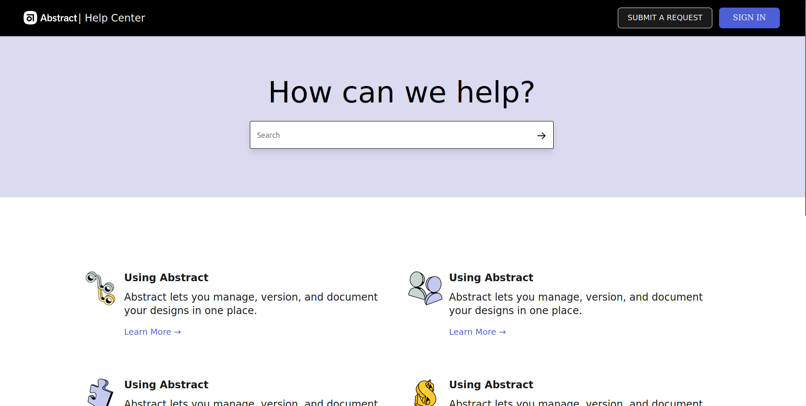

# FrontendPractice.com Project - Abstract Clone

## Introduction

Welcome to the README for the FrontendPractice.com Project - Abstract Clone! In this project, we aim to replicate the design and functionality of the popular website, Abstract.com, and provide a detailed video demonstration of the cloned webpage.



## Project Description

FrontendPractice.com Project - Abstract Clone is an exercise in frontend web development. We are replicating the user interface and user experience of the Abstract website to practice our HTML, CSS, and JavaScript skills. This project is not meant for production use and is solely for educational purposes.


## Getting Started

To explore and run this project locally, follow these steps:

1. **Clone the Repository**

   Clone this repository to your local machine using Git:

   ```bash
    git clone https://github.com/Nivas7/abstract-clone.git
   ```
2. **Open index.html**

    Open the index.html file in your preferred web browser to view the cloned Abstract website

## Project Structure

**The project directory is organized as follows:**

    - index.html: The main HTML file that represents the Abstract clone.
    - stytle.css: This contains the project's CSS stylesheet.
    - assets/: This directory holds the images and assets used in the project.

## Technologies Used

**This project uses the following technologies:**

    - HTML
    - CSS

## Credits

**Frontend Practice:**
    - This project is given by [Frontend Practice](https://www.frontendpractice.com/projects/abstract)

    - Original Abstract Website: [Abstract](https://help.abstract.com/hc/en-us)
    - This project is created for educational purposes and does not intend to infringe on any copyrights.

## Contact

**If you have any questions or need further information, you can contact us at nivasniyas24@gmail.com.**
